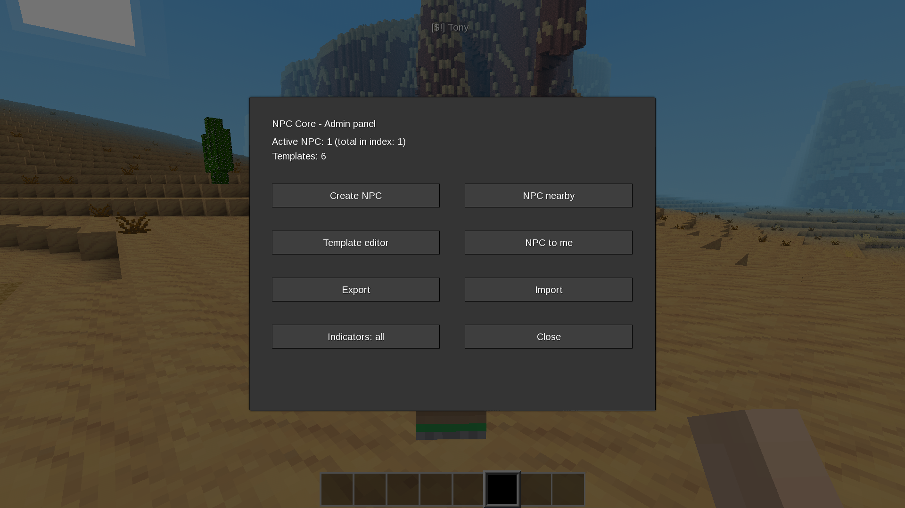
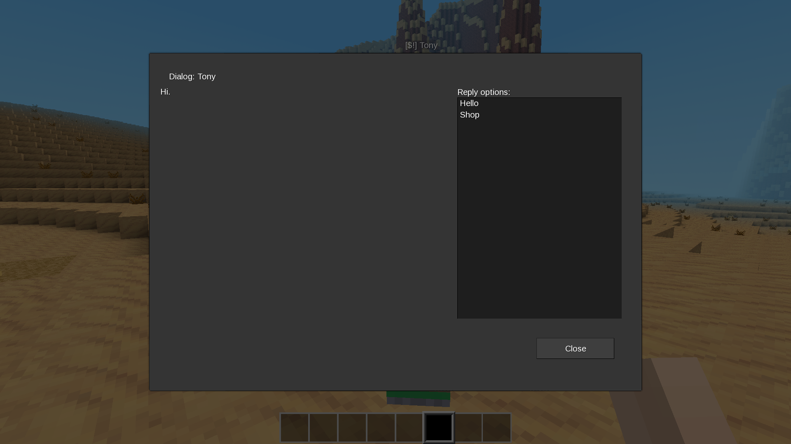
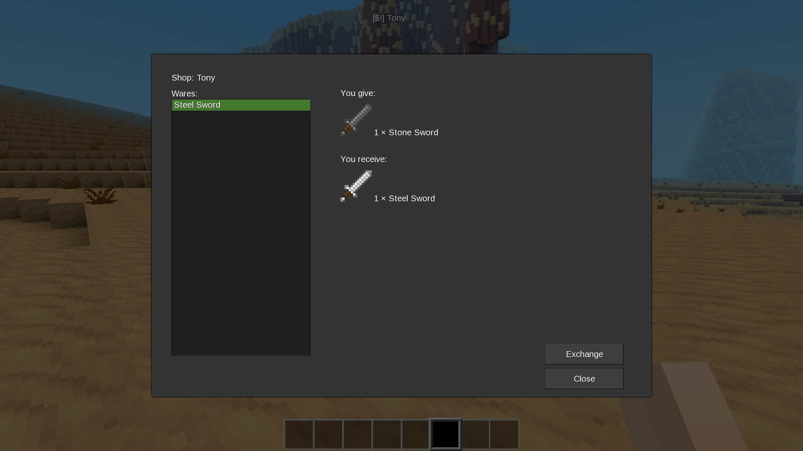
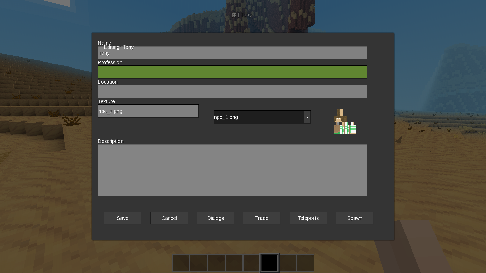
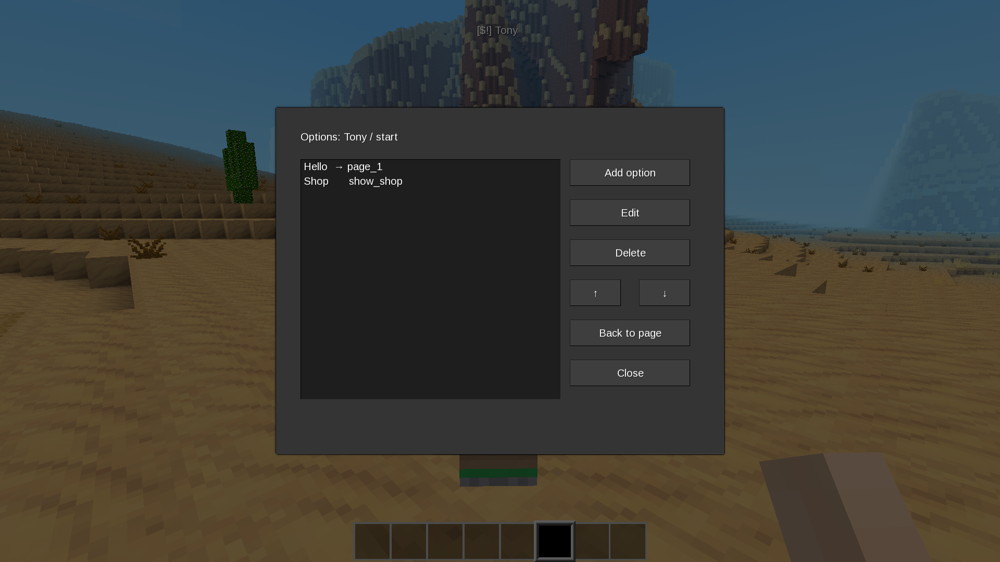
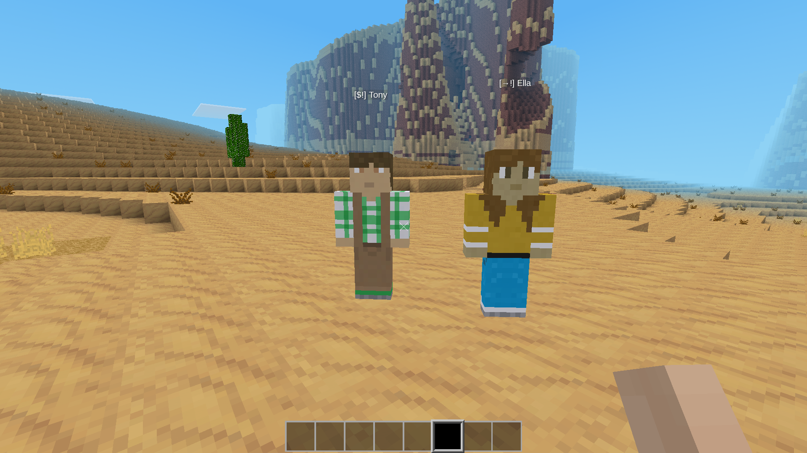
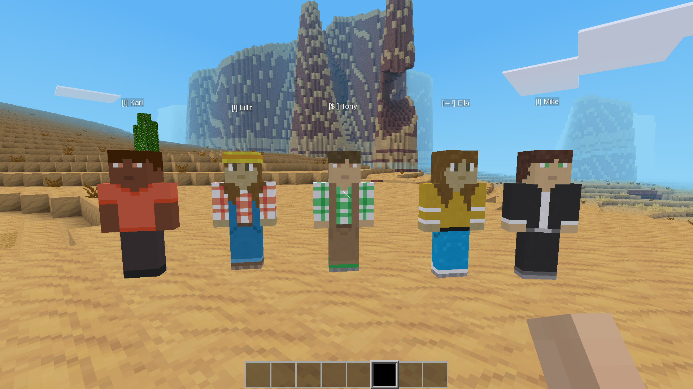

# NPC Core

A flexible NPC framework for Luanti (Minetest) that lets you create
interactive NPCs without writing any Lua. Dialogs, shops, teleports,
and everything else — through an in-game editor.

## Features

- **In-game editor** — create and edit NPCs without touching files
- **Branching dialogs** — pages with options that lead to other pages
- **Shops** — trade items with the player, supports multiple items per trade
- **Teleports** — free or paid (e.g. 1 mese crystal)
- **Nametag indicators** — icons above NPCs (shop, teleport, dialog)
- **Per-player state** — dialogs, options, and shop selections are per player
- **Export / Import** — save NPC templates as JSON, share between worlds
- **Efficient at scale** — designed for thousands of NPCs (index-based storage)
- **Translatable** — English and Ukrainian included

## Screenshots

### Admin panel



Stats, create, edit, export, import — everything from one menu.

### Dialog with reply options



Pages with text and clickable reply options.

### Shop



Trade items with the player — icons, amounts, and an exchange button.

### Template editor



Basic fields: name, profession, location, texture (with live preview),
description. Buttons to open Dialogs, Trade, Teleports, and Spawn.

### Dialog pages editor


Create, edit, and reorder dialog pages.

### Options editor



Each page has options — either jumps to another page (`→`) or triggers
an action (`⚡`).

### Nametag indicators



Icons show what each NPC offers: `$` shop, `→` teleport, `!` dialog.

### NPCs in the world



Multiple NPCs placed in the world, each with its own template,
texture, and dialogs.

## Requirements

- Luanti 5.0+ (Minetest 5.0+)
- `default` mod (part of Minetest Game)

Optional:
- `dye` — for colored items in trades

## Installation

1. Place the `npc_core` folder into your `mods/` directory.
2. Enable it in your world settings.
3. Grant yourself the `npc_admin` privilege (or use `server` in singleplayer).

## Quick Start

For players:

1. Find an NPC in the world.
2. Right-click to open a dialog.
3. Click an option to continue.

For admins:

1. Grant yourself `npc_admin`.
2. Type `/npc` in chat to open the admin panel.
3. Click **Template editor** → **New NPC**.
4. Fill in the fields, click **Save**.
5. Click **Spawn** to place the NPC in the world.

## Chat Commands

| Command | Description |
|---------|-------------|
| `/npc` | Open admin panel |
| `/npc_spawn <def_id>` | Create NPC from template in front of you |
| `/npc_here` | Move nearest NPC to your position |
| `/npc_remove` | Delete nearest NPC (radius 5) |
| `/npc_delete <id>` | Delete NPC by id (works for unloaded chunks) |
| `/npc_list [page]` | List active NPCs (paginated) |
| `/npc_count` | Statistics (active / total) |
| `/npc_yaw <angle>` | Rotate nearest NPC |
| `/npc_editor` | Open template editor |
| `/npc_indicators <mode>` | Set nametag mode: `all`, `name`, `icons`, `none` |
| `/npc_export <def_id>` | Export template to JSON file |
| `/npc_import <filename>` | Import template from JSON file |
| `/npc_exports` | List exported JSON files |

All commands require the `npc_admin` privilege.

## Admin Panel

Type `/npc` to open the main panel. From there:

- **Create NPC** — choose a template, spawn it in front of you
- **NPC nearby** — list active NPCs, move / edit / delete them
- **Template editor** — create, edit, clone, delete NPC templates
- **NPC to me** — move the nearest NPC to your position
- **Export / Import** — save or load JSON templates
- **Indicators** — cycle nametag modes

## Template Editor

Templates define what an NPC looks like and how it behaves.
Open the editor via **Template editor** in the admin panel.

### Basic fields

- **Name** — shown as nametag and dialog title
- **Profession** — shown in NPC directory
- **Location** — shown in NPC directory
- **Texture** — choose from `textures/` folder (dropdown with preview)
- **Description** — free-form text, shown in NPC directory

### Dialogs

Each template has dialog **pages**. A page has:

- **ID** — unique within the template (e.g. `start`, `about`)
- **Text** — displayed to the player
- **Options** — list of player choices

Each option has:

- **Text** — what the player sees
- **Type** — `next` (go to another page) or `action` (trigger something)
- **Target** — page ID or action name

#### Built-in actions

- `show_shop` — open the NPC shop
- `tp_<id>` — use a teleport (e.g. `tp_1`)
- `show_npc_directory` — open resident directory
- `show_info_<id>` — show info about another NPC

### Trade

Each trade has:

- **Name** — displayed in the shop list
- **You give** — items the player needs (comma-separated list)
- **You receive** — items the player gets (comma-separated list)

Format: `mod:item count`. Without count — 1.

Examples:

```
default:steel_ingot 10
default:sword_steel 1, default:sword_stone 1
```

### Teleports

Each teleport has:

- **Name** — displayed in the dialog
- **X / Y / Z** — target coordinates (use **Here** to grab current position)
- **Price** — item cost, empty for free

## Nametag Indicators

Indicators show what each NPC can do:

| Icon | Meaning |
|------|---------|
| `$` | Has a shop |
| `→` | Has teleports |
| `!` | Has dialog |

Modes:

- `all` — icons + name (default)
- `name` — only name
- `icons` — only icons
- `none` — hidden

Change mode via `/npc_indicators <mode>` or the admin panel button.

## Export / Import

Templates can be exported to JSON files in the world folder:

```
worlds/<your_world>/npc_core_exports/
```

Use **Export** / **Import** in the admin panel, or commands:

```
/npc_export arthur
/npc_import arthur.json
```

JSON files can be shared between worlds and servers.

## Advanced: Templates in Lua

For complex templates or mod integration, you can register
templates directly in Lua:

```lua
npc_core.npc_defs.my_npc = {
    name = "My NPC",
    profession = "Blacksmith",
    location = "Village",
    texture = "npc_1.png",
    info = "A friendly blacksmith.",

    pages = {
        start = {
            text = "Hello, traveler.",
            options = {
                { text = "Who are you?", next = "about" },
                { text = "Show wares", action = "show_shop" },
            },
        },
        about = {
            text = "I forge weapons and armor.",
            options = {
                { text = "Back", next = "start" },
            },
        },
    },

    trade = {
        {
            name = "Steel Sword",
            need = "default:steel_ingot 10",
            give = "default:sword_steel",
        },
    },

    teleports = {
        {
            id = 1,
            name = "To City",
            pos = { x = 100, y = 10, z = 100 },
            cost = "default:mese_crystal 1",
        },
    },
}
```

Templates registered this way are **built-in** and cannot be edited
via the in-game editor. Clone them to modify.

## Documentation

Detailed guides:

- **[Player guide](docs/PLAYERS.md)** — for players interacting with NPCs
- **[Admin guide](docs/ADMINS.md)** — for server admins
- **[Developer guide](docs/DEVELOPERS.md)** — for mod developers

## Translation

The mod is translatable. To add a language, create
`locale/npc_core.<lang>.tr` in the same format as `npc_core.en.tr`.
See existing files for examples.

## License

- **Code**: GNU General Public License v3.0 or later (see `LICENSE`)
- **Textures**: CC0 1.0 (public domain) — see `ATTRIBUTION.md`

This mod is free software: you can redistribute it and/or modify it
under the terms of the GNU General Public License as published by the
Free Software Foundation, either version 3 of the License, or (at your
option) any later version.
